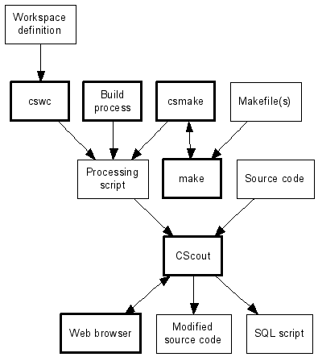

# Workflow

The following diagram illustrates the data flow when working with
*CScout*.
  
  

The thick-lined objects depict active processes;
the thin-lined objects depict data.
*CScout* will analyze and process C source code under the directions
of a processing script.
After some user interactions through a web browser *CScout* can
write out the modified source code.
*CScout* can also convert the C source code
into an SQL script that can be further analyzed and processesed through
an RDBMS.

There are three ways to generate the processing script:

1.  [Through a workspace definition file](05-wsp.md), processed by the workspace compiler *cswc*.

1.  [By having the csmake command monitor the build process](07-csmake.md).  

1.  [By tailoring a project's build process](08-pragma.md) to generate a processing script.  

Each method has different advantages and disadvantages.
Therefore, you should probably select the method that better suits your needs,
and not bother with the others.

Workspace definition files offer by far the most readable and transparent
way to setup a *CScout* workspace.
They are declarative and express exactly the operations that *CScout*
will perform.
On the other hand, they can be difficult to specify for an existing large
project and they must be kept in sync with the project's build process.

Running your *make* process under the *csmake* command is a
very easy way to generate a *CScout* processing script.
This method however only works if the essentials of your make process
aren't too contrived.
*csmake* can handle builds implemented through the Unix-related
*make*,
*gcc*, *ld*, *ar*, and *mv* commands.
It has been successfuly tested on the Linux and FreeBSD kernels and the Apache
web server.
If *csmake* can deal with your project, you will be up and running
in minutes; if not, you will only have lost those few minutes.
Another advantage of the *csmake* method
is that *csmake* will obtain from
the compiler the predefined macros and the include file path.
As a result you often don't have to tailor the files
`host-incs.h` and `host-defs.h`
to match you environment;
you can directly use the supplied file `gcc-defs.h`,
which provides workarounds for GCC extensions.

Tailoring your project's build process to generate a *CScout*
processing script is a final possibility.
Here you gain maximum flexibility and integration with the project
build system at the expense of having to modify the project's
build procedure.
If the project is relatively large and the build procedure is under your
control, this may be an option worth investigating.
