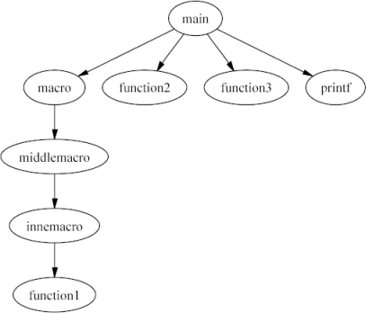

# Basic Concepts

Before we begin our in-depth description of *CScout*'s operation
it is important to define the basic concepts we will encounter:
identifiers, functions, and files.
Although you may think you know what these elements stand for,
in the *CScout* universe they have meanings sligthly different
from what you may be used to.

## Identifiers
 
A *CScout* identifier is the longest character sequence that can
be correctly modified (e.g. renamed) in isolation.
Identifiers that will have to be renamed in unison to obtain a correct program
are grouped together and are treated as a single entity.
Although you may think that, according to our definition,
*CScout* identifiers are the same as C identifiers,
this is the case only in the absence of the C preprocessor.

First of all,
the preprocessor token concatenation feature can result in
C identifiers that are composed of multiple *CScout* identifiers.
Consider the following example, which uses a macro to define a number
of different functions.
(Yes, I am familiar with the C++ templates, this is just an example.)

```c
#define typefun(name, type, op) \
type type ## _ ## name(type a, type b) { return a op b; }

typefun(add, int, +)
typefun(sub, int, -)
typefun(mul, int, *)
typefun(div, int, /)
typefun(add, double, +)
typefun(sub, double, -)
typefun(mul, double, *)
typefun(div, double, /)

main()
{
	printf("%d\n", int_add(5, 4));
	printf("%g\n", double_mul(3.14, 2.0));
}
```

In the *CScout* environment the `int_add` C identifier is
actually composed of three separate parts:

1.  `int` 

1.  `_` 

1.  `add` 

Renaming the `int` identifier into `integer`
would change it in five different places: the argument to the four
`typefun` macro invocations, and the part of `int_add`.

In addition, preprocessor macro definitions can confuse the notion of the
C scope, bringing together scopes that would be considered
separate in the context of the C language-proper.
Consider the following (slightly contrived) example:

```c
struct foo {
	int foo;
};

struct bar {
	int foo;
};

#define getpart(tag, name) (((struct tag *)p)->name)
#define getfoo(var) (var.foo)
#define get(name) (name(0) + ((struct name *)p)->name)
#define conditional(x) do {if (!x(0)) goto x; return x(0);} while(0)

int
foo(void *p)
{
	struct foo f;
	struct bar b;

foo:
	if (p && getpart(foo, foo))
		return getpart(bar, foo);
	else if (getfoo(f))
		return get(foo);
	else if (getfoo(b))
		conditional(foo);
	else
		return 0;
}
```

The identifier `foo` is occuring in a number of different
scopes:

-  as an aggregate (structure) member of two different structures,

-  as a structure tag,

-  as a statement label, and

-  as a function name.

Yet, the preprocessor macros and their use bring all the scopes together.
If we decide to change one instance of the `foo` identifier,
*CScout* will change all the instances marked below,
in order to obtain a program that has the same meaning as the original
one.
[foo](simul.md) {
  

<a id="2"></a>        int [foo](simul.md);

  

<a id="3"></a>};
  

<a id="4"></a>
  

<a id="5"></a>struct bar {
  

<a id="6"></a>        int [foo](simul.md);
  

<a id="7"></a>};
  

<a id="8"></a>
  

<a id="9"></a>#define getpart(tag, name) (((struct tag *)p)->name)
  

<a id="10"></a>#define getfoo(var) (var.[foo](simul.md))
  

<a id="11"></a>#define get(name) (name(0) + ((struct name *)p)->name)

  

<a id="12"></a>#define conditional(x) do {if (!x(0)) goto x; return x(0);} while(0)
  

<a id="13"></a>
  

<a id="14"></a>int
  

<a id="15"></a>[foo](simul.md)(void *p)

  

<a id="16"></a>{
  

<a id="17"></a>        struct [foo](simul.md) f;
  

<a id="18"></a>        struct bar b;
  

<a id="19"></a>
  

<a id="20"></a>[foo](simul.md):
  

<a id="21"></a>        if (p && getpart([foo](simul.md), [foo](simul.md)))

  

<a id="22"></a>                return getpart(bar, [foo](simul.md));
  

<a id="23"></a>        else if (getfoo(f))
  

<a id="24"></a>                return get([foo](simul.md));
  

<a id="25"></a>        else if (getfoo(b))

  

<a id="26"></a>                conditional([foo](simul.md));
  

<a id="27"></a>        else
  

<a id="28"></a>                return 0;
  

<a id="29"></a>}

| Identifier foo: test.c (Use the tab key to move to each marked element.)struct |
| --- |

## Functions
 
*CScout*, with its integrated C preprocessor, considers as functions
both the normal C functions and the function-like macros.
It can therefore identify:

-  Calls from a C function to a C function 

-  Calls from a a C function to a function-like macro 

-  Calls from a function-like macro to a C function 

-  Calls from a function-like to a function-like macro 

The following example illustrates all the above cases.

```c
#define macro() middlemacro()
#define middlemacro() innemacro()
#define innemacro() function1()
function1() {}
function2() {}
main() {
	macro();
	function2();
	function3();
	printf("Hello");
}
```

The corresponding call graph is as follows:



Note that in *CScout* functions are separate entities from identifiers.
The name of a function can consist of multiple identifiers;
an identifier can exist in more than one function names.

For instance,
the page for the `_` (underscore) identifier in the
`typefun` macro example we saw earlier
will appear as follows.
[int](simul.md)][[_](simul.md)][[add](simul.md)] - [function page](simul.md)

  1. [[int](simul.md)][[_](simul.md)][[sub](simul.md)] - [function page](simul.md)
  1. [[int](simul.md)][[_](simul.md)][[mul](simul.md)] - [function page](simul.md)

  1. [[int](simul.md)][[_](simul.md)][[div](simul.md)] - [function page](simul.md)
  1. [[double](simul.md)][[_](simul.md)][[add](simul.md)] - [function page](simul.md)

  1. [[double](simul.md)][[_](simul.md)][[sub](simul.md)] - [function page](simul.md)
  1. [[double](simul.md)][[_](simul.md)][[mul](simul.md)] - [function page](simul.md)

  1. [[double](simul.md)][[_](simul.md)][[div](simul.md)] - [function page](simul.md)
  

1.  Substitute with: 
 

[Main page](simul.md)
 - Web: [Home](simul.md)
[Manual](simul.md)
  

---
CScout 2.0 - 2004/07/31 12:37:12

| Identifier: _   Ordinary identifier: Yes Project scope: Yes Function: Yes  Matches 3 occurence(s)   Appears in project(s):  test test2   The identifier occurs (wholy or in part) in function name(s):    [ |
| --- |

Note how each function name is composed of three separate parts,
and that this instance of the `_` identifier occurs in
8 different function names.

## Files
 
Given the complexities we discussed above, you may be pleased to know
that in *CScout* files are more or less equivalent to the notion
of file you are familiar with.
The important thing to keep in mind is that *CScout* will consider
all references to the same underlying file as equivalent, no matter
how the file was named.
Thus, different paths to the same file,
or references to the same file via different symbolic links
will end-up appearing as the same file in *CScout*.

One important feature of *CScout* concerning files
has to do with the handling of files that are exact copies of each
other.
These may occur in the building of a large system for the sake of
convenience; for example, one header file may be copied to various
parts of the source code tree.
*CScout* will locate identical files and group them
together when reporting a file's details.
Identifiers occuring in the same position of two identical files
are considered equivalent; if you change the name of one of them
the name of the other will also change.
Moreover, when *CScout* reports unused identifiers it takes into
account uses of an identifier from all instances of the identical files,
not just one of them.

## Writable and Read-Only Entities
 
*CScout* uses file access permissions
(or the equivalent `readonly` and `ro_prefix` definitions
provided in workspace definition files)
to determine which elements of the compiled source code are under
your control and which elements are part of the development system.
Often the *CScout* user-interface allows you to specify whether you are
interested in writable (i.e. your project's), read-only (i.e. the system's)
or all elements.
Therefore,
all of the files that belong to your project *must* be writable.
Any other files used by your project but not belonging to it
(e.g. header files of third-party libraries or auto-generated code)
*must* either be read-only or must be flagged for treatment as
read-only using the `readonly` and `ro_prefix`
workspace definition commands.

Since *CScout* is not just a browser, but a refactoring browser,
you are expected to ensure that every file in your project is
writable.
This is how *CScout* figures out which files are part
of your project and which are system files (for instance the standard
library header files).
System files
should not be writable; if any system files happen to be writable,
use the `readonly` and `ro_prefix` workspace
definition commands to tell *CScout* to treat them as if
they are not writable.
