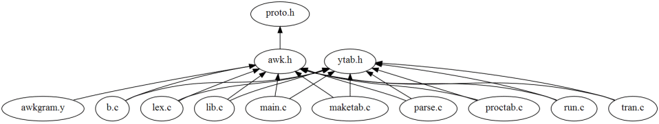
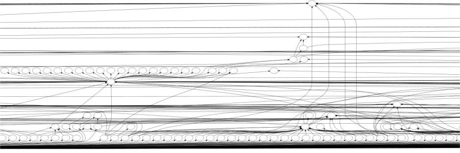
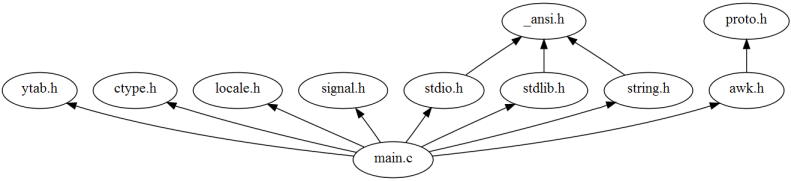
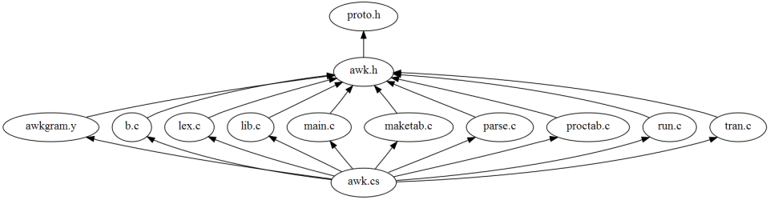

# Include Graphs

*CScout* can create include graphs that list how files include each
other.

Two global options
specify the format of the include graph and the content
on each graph's node.
Through these options you can obtain graphs in

- plain text form: suitable for processing with other tools,

-  HTML: suitable for browsing via *CScout*,

-  dot: suitable for generating high-quality graphics files,

-  SVG: suitable for graphical browsing, if your browser supports this format, and

-  GIF: suitable for viewing on SVG-challenged browsers.

All diagrams follow the notation

```
including file -> included file
```

Two links on the main page
(file include graph - writable files and
file include graph - all files)
can give you the include graphs of the complete program.
For programs larger than a hundred thousand lines,
these graphs are only useful in their textual form.
In their graphical form, even with node information disabled,
they can only serve to give you a rough idea of how the program is
structured.
The following image depicts how writable (non-system) files are
included in the *awk* source code.
  
   

and the following is a part of the include file structure of the
Windows Research Kernel
  
 

More useful are typically the include graphs that can be generated for
individual files.
These can allow you to see what paths can possibly lead to the inclusion
of a given file (include graph of all including files) or what files
a given file includes (include graph of all included files).

(call graph of all callers),
which functions can be reached starting from a given function,
and how functions in a given file relate to each other.

As an example, the following diagram depicts all files that
`main.c` includes
  
 
  

while the following diagrams shows all the files including
(directly or indirectly)
`proto.h`.
  
 
