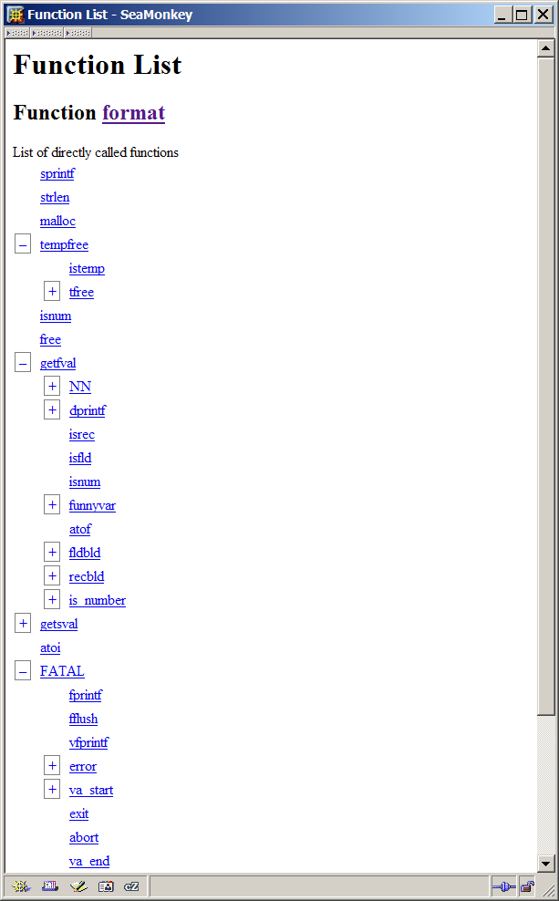

# Function Elements

Every function (C function or function like macro) is associated with
a page like the following.

[format](simul.html)]

-  Declared in file [C:\dds\src\Research\cscout\example\awk\proto.h](simul.html) [line 166](simul.html)  
(and possibly in other places)
 — [marked source](simul.html) — [edit](simul.html)-  Defined in file [C:\dds\src\Research\cscout\example\awk\run.c](simul.html) [line 793](simul.html)

 — [edit](simul.html)-  Calls directly 14 functions-  [Explore directly called functions](simul.html)
-  [List of all called functions](simul.html)
-  [Call graph of all called functions](simul.html)-  Called directly by 2 functions-  [Explore direct callers](simul.html)

-  [List of all callers](simul.html)
-  [Call graph of all callers](simul.html)-  [Call graph of all calling and called functions](simul.html) (function in context)-  Refactor arguments into: 
 

### Metrics

| Metric | Value |
| --- | --- |
| Number of characters | 3237 |
| Number of comment characters | 204 |
| Number of space characters | 767 |
| Number of line comments | 0 |
| Number of block comments | 7 |
| Number of lines | 133 |
| Maximum number of characters in a line | 95 |
| Number of character strings | 15 |
| Number of unprocessed lines | 0 |
| Number of C preprocessor directives | 0 |
| Number of processed C preprocessor conditionals (ifdef, if, elif) | 0 |
| Number of defined C preprocessor function-like macros | 0 |
| Number of defined C preprocessor object-like macros | 0 |
| Number of preprocessed tokens | 962 |
| Number of compiled tokens | 1012 |
| Number of statements or declarations | 113 |
| Number of operators | 176 |
| Number of unique operators | 15 |
| Number of numeric constants | 22 |
| Number of character literals | 43 |
| Number of if statements | 17 |
| Number of else clauses | 2 |
| Number of switch statements | 2 |
| Number of case labels | 19 |
| Number of default labels | 2 |
| Number of break statements | 14 |
| Number of for statements | 2 |
| Number of while statements | 1 |
| Number of do statements | 0 |
| Number of continue statements | 2 |
| Number of goto statements | 0 |
| Number of return statements | 1 |
| Number of project-scope identifiers | 53 |
| Number of file-scope (static) identifiers | 2 |
| Number of macro identifiers | 9 |
| Total number of object and object-like identifiers | 259 |
| Number of unique project-scope identifiers | 12 |
| Number of unique file-scope (static) identifiers | 2 |
| Number of unique macro identifiers | 5 |
| Number of unique object and object-like identifiers | 34 |
| Number of global namespace occupants at function's top | 1063 |
| Number of parameters | 4 |
| Maximum level of statement nesting | 4 |
| Number of goto labels | 0 |
| Fan-in (number of calling functions) | 2 |
| Fan-out (number of called functions) | 14 |
| Cyclomatic complexity (control statements) | 23 |
| Extended cyclomatic complexity (includes branching operators) | 27 |
| Maximum cyclomatic complexity (includes branching operators and all switch branches) | 44 |
| Structure complexity (Henry and Kafura) | 784 |
| Halstead volume | 3416.45 |
| Information flow metric (Henry and Selig) | 18032 |

[Main page](simul.html)
 — Web: [Home](simul.html)
[Manual](simul.html)
  

---
CScout

| Metric | Value |
| --- | --- |
| Number of characters | 3237 |
| Number of comment characters | 204 |
| Number of space characters | 767 |
| Number of line comments | 0 |
| Number of block comments | 7 |
| Number of lines | 133 |
| Maximum number of characters in a line | 95 |
| Number of character strings | 15 |
| Number of unprocessed lines | 0 |
| Number of C preprocessor directives | 0 |
| Number of processed C preprocessor conditionals (ifdef, if, elif) | 0 |
| Number of defined C preprocessor function-like macros | 0 |
| Number of defined C preprocessor object-like macros | 0 |
| Number of preprocessed tokens | 962 |
| Number of compiled tokens | 1012 |
| Number of statements or declarations | 113 |
| Number of operators | 176 |
| Number of unique operators | 15 |
| Number of numeric constants | 22 |
| Number of character literals | 43 |
| Number of if statements | 17 |
| Number of else clauses | 2 |
| Number of switch statements | 2 |
| Number of case labels | 19 |
| Number of default labels | 2 |
| Number of break statements | 14 |
| Number of for statements | 2 |
| Number of while statements | 1 |
| Number of do statements | 0 |
| Number of continue statements | 2 |
| Number of goto statements | 0 |
| Number of return statements | 1 |
| Number of project-scope identifiers | 53 |
| Number of file-scope (static) identifiers | 2 |
| Number of macro identifiers | 9 |
| Total number of object and object-like identifiers | 259 |
| Number of unique project-scope identifiers | 12 |
| Number of unique file-scope (static) identifiers | 2 |
| Number of unique macro identifiers | 5 |
| Number of unique object and object-like identifiers | 34 |
| Number of global namespace occupants at function's top | 1063 |
| Number of parameters | 4 |
| Maximum level of statement nesting | 4 |
| Number of goto labels | 0 |
| Fan-in (number of calling functions) | 2 |
| Fan-out (number of called functions) | 14 |
| Cyclomatic complexity (control statements) | 23 |
| Extended cyclomatic complexity (includes branching operators) | 27 |
| Maximum cyclomatic complexity (includes branching operators and all switch branches) | 44 |
| Structure complexity (Henry and Kafura) | 784 |
| Halstead volume | 3416.45 |
| Information flow metric (Henry and Selig) | 18032 |
| Information flow metric (Henry and Selig) | 18032 | 18032 |

From this page you can refactor the function's arguments
(more on this in the next section) and obtain the following data.

-  The identifier or identifiers composing the function name.
These can be modified (from the corresponding identifier page)
to change the function's name.

-  The function's declaration. This may be an implicit declaration
(the location of its first use).
*CScout* only maintains the location of one declaration for
each function.
You can locate additional points of declaration by looking at the
places where the corresponding identifier is used.
The "marked source" link allows you to see the declaration as
a hyperlink in the file where it occurs.
In many browsers pressing the tab key on that page will lead you
directly to the function's declaration.

-  The function's definition (if a definition was found).
Library functions obviously will not have a definition associated with them.

-  The number of functions this function directly calls.
These are the functions (C functions and function-like macros)
that appear inside the function's body.

- 
A list allowing you to explore interactively the tree of called functions.
The tree will appear in the following form:
  
  

Each plus or minus box will open or close the list of called functions.
Each function name is a hyperlink to the corresponding function page.

-  A list of all called functions.
This list includes all functions that can be called,
starting from the function we are examining.
On the right of each function is
a hyperlink to a call graph of the path(s) leading from
the function being examined to the function listed.

-  A call graph of all called functions (explained in a following section).

-  A page allowing you to explore interactively all callers.
These are the functions that directly call the function we are examining.
The functionality of this page is the same as that of the one for exploring
the called functions.

-  A list of all callers.
These are all functions that can directly or
indirectly call the function we are examining.

-  A call graph of all callers (explained in a following section).

-  A call graph of all the function's callers and called functions
showing the function in context (explained in a following section).

-  A comprehensive set of metrics regarding the function
(only for defined functions and macros).

## All Functions

The all functions page will list all the functions (C functions
and function-like macros) defined or declared
in the *CScout* workspace.
In moderately sized projects,
you can use it as a starting point for jumping to a function;
in larger projects it is probably useful only as a last resort.

## Project-scoped writable functions

This page contains all the writable functions that are globaly visible.
The page does not list function-like macros.

## File-scoped writable functions

This page contains all the writable functions that are visible only
within the context of a single file.
This include C functions declared as `static`, and function-like
macros.

## Writable functions that are not directly called

This page will list all writable functions that are never directly
called.
The most probable cause is that the corresponding functions are called through
a pointer,
but some may be historic leftovers - candidates for removal.

## Writable functions that are called exactly once

Functions that are called exactly once may be candidates for inlining.
