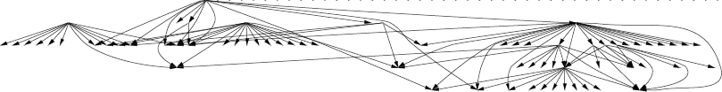
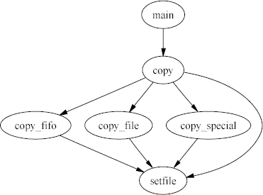
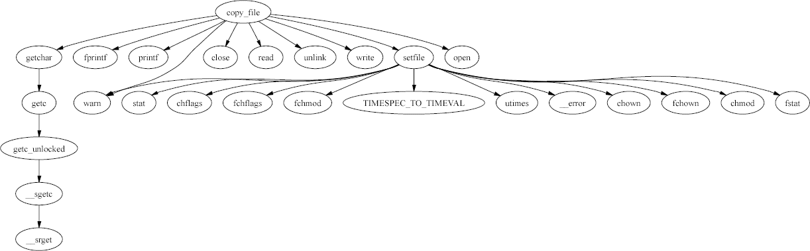
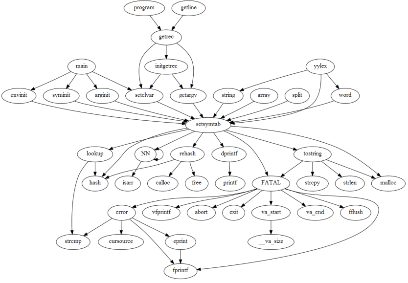
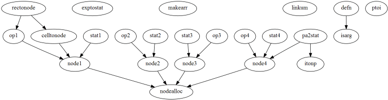

# Call Graphs

*CScout* can create call graphs that list how functions call each
other.
Keep in mind that the graphs only indicate the calls detected by statically
analyzing the program source.
Calls via function pointers will not appear in the call graph.

Two global options
specify the format of the call graph and the content
on each graph's node.
Through these options you can obtain graphs in

- plain text form: suitable for processing with other tools,

-  HTML: suitable for browsing via *CScout*,

-  dot: suitable for generating high-quality graphics files,

-  SVG: suitable for graphical browsing, if your browser supports this format, and

-  GIF: suitable for viewing on SVG-challenged browsers.

All diagrams follow the notation

```
calling function -> called function
```

Two links on the main page
(function and macro call graph, and non-static function call graph)
can give you the call graphs of the complete program.
For any program larger than a few thousand lines,
these graphs are only useful in their textual form.
In their graphical form, even with node information disabled,
they can only serve to give you a rough idea of how the program is
structured.
The following image depicts how the three different programs we
analyzed in the *bin* example relate to each other.
  
 

More useful are the call graphs that can be generated for individual
functions or files.
These can allow you to see what paths can possibly lead to a given function
(call graph of all callers),
which functions can be reached starting from a given function,
the function in context,
and how functions in a given file relate to each other.

As an example, the following diagram depicts all paths leading to the
`setfile` function.
  
 

Correspondingly, the functions that can be reached starting from the
`copy_file` function appears in the following diagram.
  
 

while the following shows the function `setsymtab` in context,
depicting all the paths leading to it (callers) and leaving from it
(called functions).
  
 

Finally, the following is an example of how the functions in a single
file (parse.c) relate to each other.
  
 
