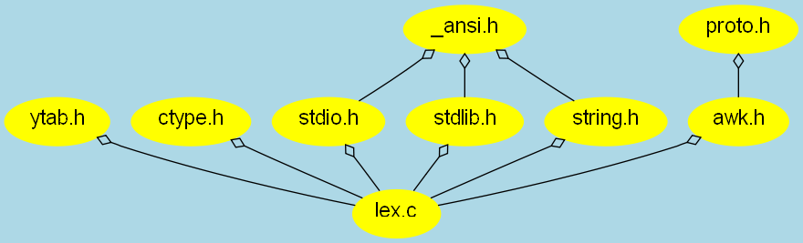

# Global Options

The operations *CScout* provides group together functions
that globally affect its operation.
The global options link leads you to the following page.

| File and Identifier Pages |
| --- |
| Show only true identifier classes (brief view) |  |
| Show associated projects |  |
| Show a list of identical files |  |
| Source Listings |
| Show line numbers |  |
| Tab width |  |
| Refactoring |
| Allow the renaming of read-only identifiers |  |
| Allow the refactoring of function arguments of read-only functions |  |
| Check for renamed identifier clashes when saving refactored code |  |
| Queries |
| Case-insensitive file name regular expression match |  |
| Query Result Lists |
| Number of entries on a page |  |
| Show file lists with file name in context |  |
| Sort identifiers starting from their last character |  |
| Call and File Dependency Graphs |
| Graph links should lead to pages of: | dot GIF HTML PDF plain text PNG SVG |
| Call graphs should contain: | only edges function names file and function names path and function names |
| File graphs should contain: | only edges file names path and file names |
| Maximum number of call levels in a call graph |  |
| Maximum dependency depth in a file graph |  |
| Include URLs in dot output |  |
| Graph options |  |
| Node options |  |
| Edge options |  |
| Saved Files |
| When saving modified files replace RE |  |
| ... with the string |  |
| Editing |
| External editor invocation command |  |

[Main page](simul.md)
 — Web: [Home](simul.md)

[Manual](simul.md)
  

---
CScout

| File and Identifier Pages |
| --- |
| Show only true identifier classes (brief view) |  |
| Show associated projects |  |
| Show a list of identical files |  |
| Source Listings |
| Show line numbers |  |
| Tab width |  |
| Refactoring |
| Allow the renaming of read-only identifiers |  |
| Allow the refactoring of function arguments of read-only functions |  |
| Check for renamed identifier clashes when saving refactored code |  |
| Queries |
| Case-insensitive file name regular expression match |  |
| Query Result Lists |
| Number of entries on a page |  |
| Show file lists with file name in context |  |
| Sort identifiers starting from their last character |  |
| Call and File Dependency Graphs |
| Graph links should lead to pages of: | dot GIF HTML PDF plain text PNG SVG |
| Call graphs should contain: | only edges function names file and function names path and function names |
| File graphs should contain: | only edges file names path and file names |
| Maximum number of call levels in a call graph |  |
| Maximum dependency depth in a file graph |  |
| Include URLs in dot output |  |
| Graph options |  |
| Node options |  |
| Edge options |  |
| Saved Files |
| When saving modified files replace RE |  |
| ... with the string |  |
| Editing |
| External editor invocation command |  |
| External editor invocation command |  |  |

The meaning of each option is described in the following sections.

## File and Identifier Pages
 

###  Show Only True Identifier Classes
 
Setting the option ``show only true identifier classes (brief view)''
will remove from each identifier page all identifier properties
marked as no, resulting in a less verbose page.

[cp.c](simul.md)[marked source](simul.md)

| Directory | File |
| --- | --- |
| /vol/src/bin/cp/ |  |  |

### Dependent Files (All)

[cp.c](simul.md)[marked source](simul.md)

| Directory | File |
| --- | --- |
| /vol/src/bin/cp/ |  |  |

[Main page](simul.md)
 - Web: [Home](simul.md)

[Manual](simul.md)
  

---
CScout 2.0 - 2004/07/31 12:37:12

| Directory | File |
| --- | --- |
| /vol/src/bin/cp/ |  |  |
| /vol/src/bin/cp/ |  |  |  |

###  Show Associated Projects 
 
Normally, each identifier or file page lists the projects in which
the corresponding identifier or file has appeared during processing.
When the *CScout* workspace typically consists only of a single project,
or consists of hundreds of projects, listing the project membership
can be useless or result into too volumneous output.
The corresponding option can be used to control this output.

###  Show Lists of Identical Files 
 
*CScout* will detect during processing when a file is an exact
duplicate of another file (typically the result of a copy operation
during the building process).
On the file information page it will then list the files that are
duplicates of the one being listed.
The corresponding option can be used to control this output.

## Source Listings
 

###  Show Line Numbers 
 
The "show line numbers in source listings" option
allows you to specify whether the source file line numbers will be shown
in source listings.
Line numbers can be useful when you are editing or viewing the same 
file with an editor.
A file with line numbers shown appears as follows:

| 78 fa *makedfa(const char *s, int anchor)  /* returns dfa for reg expr s */    79 {    80         int i, use, nuse;    81         fa *pfa;    82         static int now = 1;    83     84         if (setvec == 0) {      /* first time through any RE */    85                 maxsetvec = MAXLIN;    86                 setvec = (int *) malloc(maxsetvec * sizeof(int));    87                 tmpset = (int *) malloc(maxsetvec * sizeof(int));    88                 if (setvec == 0 || tmpset == 0)    89                         overflo("out of space initializing makedfa");    90         }    91     92         if (compile_time)       /* a constant for sure */    93                 return mkdfa(s, anchor);    94         for (i = 0; i < nfatab; i++)    /* is it there already? */    95                 if (fatab[i]->anchor == anchor    96                   && strcmp((const char *) fatab[i]->restr, s) == 0) {    97                         fatab[i]->use = now++;    98                         return fatab[i];    99                 }   100         pfa = mkdfa(s, anchor);   101         if (nfatab < NFA) {     /* room for another */   102                 fatab[nfatab] = pfa;   103                 fatab[nfatab]->use = now++;   104                 nfatab++;   105                 return pfa;   106         } |
| --- |

###  Tab Width 
 
The ``code listing tab width'' option allows you to specify
the tab width to use when listing source files as hypertext
(8 by default).
The width should match the width normally used to display the file.
It does not affect the way the modified file is written;
tabs and spaces will get written exactly as found in the source code file.

## Refactoring
 

### Allow the renaming of read-only identifiers
 
Setting this option will present a rename identifier box,
in an identifier's page, even if that identifier occurs in read-only
files.
When *CScout* exist saving refactoring changes,
replacements in those files may fail due to file system permissions.

### Allow the refactoring of function arguments of read-only functions
 
Setting this option will present a function argument refactoring template
input box
in an function's page, even if that identifier associated with the
function occurs in read-only files.

### Check for renamed identifier clashes when saving refactored code
 
Setting this option will reprocess the complete source code (re-execute
the processing script) before saving code with renamed identifiers,
in order to verify that no accidental clashes were introduced.
Identifier clashes are reported on the command-line console as errors.
The check is enabled by default.
For very large projects and if you are sure no clashes were accidentally
introduced you may disable the check in order to save the additional
processing time.

## Queries
 

###  Case-insensitive File Name Regular Expression Match 
 
Some environments, such as Microsoft Windows,
are matching filenames in a case insensitive manner.
As a result the same filename may appear with different 
capitalization (e.g. `Windows.h`, `WINDOWS.h`, and
`windows.h`).
The use of the
``case-insensitive file name regular expression match''
option makes filename regular expression matches
ignore letter case thereby matching the operating system's semantics.

## Query Result Lists
 

### Number of Entries on a Page
 
The number of entries on a page, specifies the number of records
appearing on each separate page resulting
from a file, identifier, or function query.
Too large values of this option (say above 1000) may cause your
web browser to behave sluggishly, and will also reduce the program's
responsiveness when operating over low-bandwidth network links.

###  Show File Lists With File Name in Context
 
Setting the ``Show file lists with file name in context'' option
will result in file lists showing the file name (the last component
of the complete path) in the same position,
as in the following example:

[ctype.h](simul.md)

[err.h](simul.md)

[errno.h](simul.md)

[fcntl.h](simul.md)

[fts.h](simul.md)

[limits.h](simul.md)

[locale.h](simul.md)

[ansi.h](simul.md)

[endian.h](simul.md)

[limits.h](simul.md)

[param.h](simul.md)

[signal.h](simul.md)

[trap.h](simul.md)

[types.h](simul.md)

[ucontext.h](simul.md)

[runetype.h](simul.md)

[stdio.h](simul.md)

[stdlib.h](simul.md)

[string.h](simul.md)

[_posix.h](simul.md)

[cdefs.h](simul.md)

[inttypes.h](simul.md)

[param.h](simul.md)

[signal.h](simul.md)

[stat.h](simul.md)

[syslimits.h](simul.md)

[time.h](simul.md)

[types.h](simul.md)

[ucontext.h](simul.md)

[unistd.h](simul.md)

[sysexits.h](simul.md)

[syslog.h](simul.md)

[time.h](simul.md)

[unistd.h](simul.md)

| Directory | File |
| --- | --- |
| /usr/include/ |  |
| /usr/include/ |  |
| /usr/include/ |  |
| /usr/include/ |  |
| /usr/include/ |  |
| /usr/include/ |  |
| /usr/include/ |  |
| /usr/include/machine/ |  |
| /usr/include/machine/ |  |
| /usr/include/machine/ |  |
| /usr/include/machine/ |  |
| /usr/include/machine/ |  |
| /usr/include/machine/ |  |
| /usr/include/machine/ |  |
| /usr/include/machine/ |  |
| /usr/include/ |  |
| /usr/include/ |  |
| /usr/include/ |  |
| /usr/include/ |  |
| /usr/include/sys/ |  |
| /usr/include/sys/ |  |
| /usr/include/sys/ |  |
| /usr/include/sys/ |  |
| /usr/include/sys/ |  |
| /usr/include/sys/ |  |
| /usr/include/sys/ |  |
| /usr/include/sys/ |  |
| /usr/include/sys/ |  |
| /usr/include/sys/ |  |
| /usr/include/sys/ |  |
| /usr/include/ |  |
| /usr/include/ |  |
| /usr/include/ |  |
| /usr/include/ |  |

You can bookmark this page to save the respective query

[Main page](simul.md)

| Directory | File |
| --- | --- |
| /usr/include/ |  |
| /usr/include/ |  |
| /usr/include/ |  |
| /usr/include/ |  |
| /usr/include/ |  |
| /usr/include/ |  |
| /usr/include/ |  |
| /usr/include/machine/ |  |
| /usr/include/machine/ |  |
| /usr/include/machine/ |  |
| /usr/include/machine/ |  |
| /usr/include/machine/ |  |
| /usr/include/machine/ |  |
| /usr/include/machine/ |  |
| /usr/include/machine/ |  |
| /usr/include/ |  |
| /usr/include/ |  |
| /usr/include/ |  |
| /usr/include/ |  |
| /usr/include/sys/ |  |
| /usr/include/sys/ |  |
| /usr/include/sys/ |  |
| /usr/include/sys/ |  |
| /usr/include/sys/ |  |
| /usr/include/sys/ |  |
| /usr/include/sys/ |  |
| /usr/include/sys/ |  |
| /usr/include/sys/ |  |
| /usr/include/sys/ |  |
| /usr/include/sys/ |  |
| /usr/include/ |  |
| /usr/include/ |  |
| /usr/include/ |  |
| /usr/include/ |  |
| /usr/include/ |  |  |

This results in lists that are easier to read, but that can not 
be easilly copy-pasted into other tools for further processing.

### Sort Identifiers Starting from their Last character 
 
Some coding conventions use identifier suffixes for distinguishing the
use of a given identifier.
As an example, typedef identifiers often end in `_t`.
The following list contains our example's typedefs ordered by the last
character, making it easy to distinguish typedefs not ending
in `_t`

[FILE](simul.md)  

[FTS](simul.md)  

[FTSENT](simul.md)  

[PATH_T](simul.md)  

[_RuneRange](simul.md)  

[_RuneLocale](simul.md)  

[u_long](simul.md)  

[fd_mask](simul.md)  

[u_char](simul.md)  

[physadr](simul.md)  

[int32_t](simul.md)  

[__int32_t](simul.md)  

[u_int32_t](simul.md)  

[uint32_t](simul.md)  

[__uint32_t](simul.md)  

[inthand2_t](simul.md)  

[ointhand2_t](simul.md)  

[int64_t](simul.md)  

[... 40 lines removed]  

[in_addr_t](simul.md)  

[caddr_t](simul.md)  

[c_caddr_t](simul.md)  

[v_caddr_t](simul.md)  

[daddr_t](simul.md)  

[ufs_daddr_t](simul.md)  

[u_daddr_t](simul.md)  

[qaddr_t](simul.md)  

[__sighandler_t](simul.md)  

[__siginfohandler_t](simul.md)  

[timer_t](simul.md)  

[register_t](simul.md)  

[u_register_t](simul.md)  

[intptr_t](simul.md)  

[__intptr_t](simul.md)  

[uintptr_t](simul.md)  

[__uintptr_t](simul.md)  

[fpos_t](simul.md)  

[timecounter_pps_t](simul.md)  

[timecounter_get_t](simul.md)  

[vm_offset_t](simul.md)  

[vm_ooffset_t](simul.md)  

[sigset_t](simul.md)  

[osigset_t](simul.md)  

[fixpt_t](simul.md)  

[in_port_t](simul.md)  

[mcontext_t](simul.md)  

[ucontext_t](simul.md)  

[dev_t](simul.md)  

[div_t](simul.md)  

[ldiv_t](simul.md)  

[vm_pindex_t](simul.md)  

[key_t](simul.md)  

[segsz_t](simul.md)  

[fd_set](simul.md)  

[u_int](simul.md)  

[uint](simul.md)  

[u_short](simul.md)  

[ushort](simul.md)  

[_RuneEntry](simul.md)  

 
|  |  |
| --- | --- |

|  |  |
| --- | --- |
|  |  |  |

## Call and File Dependency Graphs
 

### Call Graph Links Should Lead to Pages of
 
Function and macro call graphs can appear in four different formats.

-  Plain text: suitable for processing with other text tools.
-  HTML: suitable for interactive browsing
-  dot: suitable for processing with GraphViz dot into different
graphics formats, like PNG, MIF, VRML, and EPS.
Dot files can also be processed as graphs using the
AT&T *gpr* program
-  SVG: suitable for interactively browsing the graphical representation
of the call graph.
This option requires your browser to support the rendering of SVG
(directly or via a plugin, such as
[Adobe's](http://www.adobe.com/svg/)), and the existence of
the AT&T [GraphViz](http://www.graphviz.org) *dot*
program in your executable file path.
-  GIF: suitable for directly viewing relatively small images.

### Call Graphs Should Contain
 
This option allows you to specify the level of detail you wish to see
in the call graph nodes.

-  Only edges, will not display anything on the node.
This option can be used in the graphics formats (dot, SVG, GIF) to
provide an overall picture of the program's call structure.

-  Function names: only include the function names.
Functions with the same name will still be separately listed,
but you will have to follow their hyperlinks to see where they
are defined.

-  File and function names: the name of the file where a function
is declared will precede the name of the function.

-  Path and function names: the complete file path of the file
where a function
is declared will precede the name of the function.

### File Graphs Should Contain
 
This option allows you to specify the level of detail you wish to see
in the file dependency graph nodes.

-  Only edges, will not display anything on the node.
This option can be used in the graphics formats (dot, SVG, GIF) to
provide an overall picture of the program's file dependency structure.

-  File names: only include the file names.
Files with the same name will still be separately listed,
but you will have to follow their hyperlinks to see where they
are defined.

-  Path and file names: the complete path of each path will be show.

### Maximum number of call levels in a graph
 
Call graphs can easily grow too large for viewing, printing, or even
formatting as a graph.
This option limits the number of functions that will be traversed from a
specific function when computing a call graph
or a list of calling or called functions.

### Maximum dependency depth in a file graph
 
File dependency graphs can easily grow too large for viewing, printing, or even
formatting as a graph.
This option limits the number of edges that will be traversed from the root
file when computing a file dependency graph.

### Include URLs in dot output
 
By checking this option
URLs to *CScout*'s interface will be included in plain *dot*
output.
In typical cases, URLs outside the context of *CScout*'s operation
don't make sense, but there are specialized instances where you might
want to post-process the output with a tool, and then display
the graph in a way that will provide you links to *CScout*.

### Graph options
 
A semicolon-separated list of options that will be passed to *dot*
as graph attributes.
Graph attributes accepted by *dot* include
size, page, ration, margin, nodesep, ranksep, ordering, rankdir,
pagedir, rank, rotate, center, nslimit, mclimit, layers, color,
href, URL, and stylesheet.

### Node options
 
A comma-separated list of options that will be passed to *dot*
as node attributes.
Node attributes accepted by *dot* include
height, shape, fontsize, fontname, color, fillcolor, fontcolor, style, layer,
regular, peripheries, sides, orientation, distortion, skew, href, URL,
target, and tooltip.
Note that node options are ignored, if the option to draw empty nodes is
set.

### Edge options
 
A comma-separated list of options that will be passed to *dot*
as edge attributes.
Edge attributes accepted by *dot* include
minlen, weight, label, fontsize, fontname, fontcolor, style, color,
dir, tailclip, headclip, href, URL, target, tooltop, arrowhead,
arrowtail, arrowsize, headlabel, taillabel,
headref, headURL, headtarget, headtooltip,
tailref, tailURL, tailtarget, tailtooltip,
labeldistance, decorate, samehead, sametail, constraint, and layer.

The graph, node, and edge options can be used to fine tune the graph's
look.
See the
[GraphViz documentation](http://www.graphviz.org/doc/info/attrs.md)
for more details.
For instance, the following diagram
  
  

was created using  

| Graph options | bgcolor=lightblue |
| --- | --- |
| Node options | color=yellow,fontname="Helvetica",fillcolor=yellow,style=filled |
| Edge options | arrowtail=odiamond |

## Saved Files
 

### When Saving Modified Files Replace
 
When saving files where an identifier has been modified
it is often useful to use a different directory than the
one where the original version of the source code resides.
This allows you to

-  continue operating CScout, even after the changes have been saved, and 

-  easilly back out changes your are not satisfied with. 

To use this option, specify a regular expression that will match
a path component of the original source code files (often just a fixed
string), and a corresponding substitution string.
As an example, if your project files are of the type
`/home/jack/src/foo/filename.c`, you could
specify that `/foo/` should be changed
into `/../foo.new/`.

Note than when this option is specified the existing and new locations
of the file must reside on the same drive and partition (under Windows)
or file system (under Unix).

## Editing
 
The "External editor invocation command" allows the specification of the
editor that wil be used for hand-editing files.
This string can contain two `%s` placeholders.
The first is substituted by a regular expression that is associated
with the identifier for which the file is edited,
while the second is substituted with the corresponding file name.
The default string under Unix is

```bash
xterm -c "$VISUAL +/'%s' '%s'"
```

and under Windows

```bat
echo Ignoring search for "%s" & start notepad "%s"
```

Under Windows a more sensible default could be something like

```bat
start  C:\Progra~1\Vim\vim70\gvim.exe +/"%s" "%s"
```

which fires off the VIM editor in a new window.
